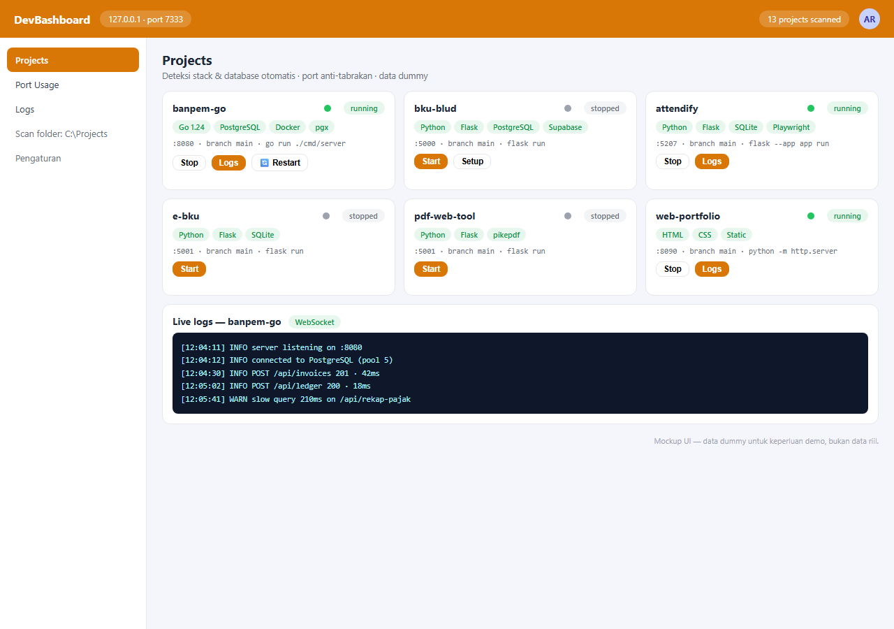

# DevBashboard

[](https://github.com/adityarahmanananda-dev/dev-bashboard/actions/workflows/ci.yml)

```
$_  DevBashboard
```

A local dashboard for developers: scan project folders, detect **stack** and **database**, manage **collision-free ports**, then **start/stop applications** — native or Docker Compose — right from the browser.

Everything runs on `127.0.0.1` (not exposed to the network), no accounts, no cloud.

## Screenshot



> Screenshot is a UI mockup with dummy data — not real data.

---

## Features

### 📁 Scan any folder
Click the path in the top-left of the dashboard to choose any folder to scan (browse or type a manual path). Also possible via CLI:

```bash
dev-bashboard --root ~/Projects
```

### 🔍 Automatic stack detection
Each project's framework, git branch, and README description are detected:

| Language/Framework | Detection method |
|---|---|
| Python (Flask, FastAPI, Django) | `app.py`, `manage.py`, imports in source, `requirements.txt` |
| Go | `go.mod` at root or nested (`backend/`, `server/`, etc.) |
| Node.js (Express, Electron, Next.js, Vite, React…) | `package.json` + dependencies |
| Docker Compose | `docker-compose.yml` / `compose.yaml` → **Start (Docker)** button |
| Static HTML/CSS/JS | `index.html` without backend code |

Projects with a compose file get a **▶ Start (Docker)** button (`docker compose up -d --build`) plus a secondary **⚡ Native** button to run without Docker.

### 🗄 Database detection
A badge per project shows the engine **and** its hosting:

| Badge | Meaning |
|---|---|
| `PostgreSQL · ☁️ Supabase` | Online/cloud DB (recognized hosts: Supabase, Neon, Atlas, RDS, Railway, etc.) |
| `MySQL · 🐳 docker local` | DB service defined in compose |
| `PostgreSQL · 🖥️ local` | Connection to localhost / non-cloud host |
| `SQLite · 📄 file local` | `*.db`/`*.sqlite` file or SQLite driver |

Detection sources: dependencies, `.env`, connection strings in source code, `prisma/schema.prisma`, compose service images.

### 🔌 Collision-free port management
- **🎲 find** button picks a random free port in the **20000–65535** range
- Default service/dev-server ports (postgres `5432`, mysql `3306`, redis `6379`, node dev `3000`, vite `5173`, etc.) are **hard-rejected** at start
- Ports already in use by another process are rejected with a message showing who owns them:
  > `Port 56002 sudah dipakai oleh python3 (pid 8805)`
- Per-project port choices are remembered across restarts (`data/state.json`)
- The sidebar lists all currently listening ports with their processes

### ⚙️ Clean start/stop
- Processes are managed per **process group** → stopping also kills Flask reloaders, `go run` children, and npm wrapper scripts
- Project status survives a dashboard restart (native processes are adopted via pgid, Docker containers checked via `compose ps`)
- Realtime per-project logs via WebSocket

### 🐳 Docker Compose support
- Start = `docker compose up -d --build` with a unique project name (`-p`)
- **Automatic host-port override**: change the port in the dashboard → DevBashboard writes an override file with the `!override` tag in `data/compose-overrides/` (requires Docker Compose v2.24+), so the original project files are never touched
- Stop = `docker compose down`
- The project's `.env` is loaded automatically on native start — `DATABASE_URL` (Supabase etc.) is carried over

### 📦 Multi-stack dependency setup
The **🛠 Setup** button is available for every stack with a known manifest:

| Stack | Manifest | Setup step | "Ready" check |
|---|---|---|---|
| Python/pip | requirements.txt / pyproject.toml | create venv `<name>.venv` → `pip install` | `pip install --dry-run` |
| Node/npm | package.json | `npm install` | fresh node_modules vs lockfile + setup success marker |
| Go modules | go.mod (incl. nested `backend/` etc.) | `go mod download` | `go mod verify` |
| Java/Maven | pom.xml | `mvn dependency:resolve` (or ./mvnw) | setup success marker |
| Java/Gradle | build.gradle(.kts) / settings.gradle(.kts) | `gradle dependencies` (or ./gradlew) | setup success marker |
| C++/Conan | conanfile.txt / conanfile.py | `conan install --build=missing` | setup success marker |
| C++/vcpkg | vcpkg.json | `vcpkg install` ($VCPKG_ROOT or PATH) | setup success marker |

- Manifests are searched at the project root and in standard subfolders (backend/server/src/client/frontend/app)
- Missing tools produce an actionable error message, not a crash
- Setup success markers are stored in `data/setup-marks/` (outside the project repo) and auto-invalidated if the manifest changes afterwards

---

## Installation

Prerequisites:
- **Node.js ≥ 18**
- **Docker + Docker Compose v2.24+** *(optional, only for compose features)*

```bash
git clone git@github.com:adityarahmanananda-dev/dev-bashboard.git
cd dev-bashboard
npm install
npm link          # register the global "dev-bashboard" command
```

> Without `npm link` you can also run `npm start` and open `http://127.0.0.1:7333`.

## Usage

```bash
dev-bashboard                     # start + auto-open browser
dev-bashboard -p 8080             # specific dashboard port
dev-bashboard -r ~/kode           # initial scan folder
dev-bashboard --no-open           # no auto-open browser
dev-bashboard --help              # help
dev-bashboard --version
```

The browser opens automatically to `http://127.0.0.1:<port>` (via `xdg-open`). Press `Ctrl+C` to stop the dashboard; running projects **do not** stop and are re-adopted next time.

## How port override works

| Stack | Override mechanism |
|---|---|
| Docker Compose | Compose override file (`ports: !override`) |
| Flask reading env | env `PORT` |
| Flask with hardcoded port | `flask --app <entry> run --port <N>` |
| Go (env `ADDR`/`PORT`) | env `ADDR=:<port>` |
| Node (npm dev/start) | env `PORT` |
| Static HTML | `python3 -m http.server <port> --bind 127.0.0.1` |

If the mechanism isn't recognized (e.g. hardcoded port without Flask CLI), the project card shows a warning that the port follows the code.

## Architecture

```
dev-bashboard/
├── bin/dev-bashboard.js   CLI launcher (arg parsing, xdg-open)
├── server/
│   ├── index.js           HTTP server + REST API + WebSocket
│   ├── scanner.js         Stack/database detection, start recipe
│   ├── runner.js          Process lifecycle (spawn/pgid/adopt/persist)
│   ├── docker.js          Compose helpers: up/status/down/log/override
│   ├── ports.js           Listening check, reserved list, port suggestions
│   └── state.js           State persistence (scan folder, port choices)
├── public/                Vanilla JS frontend (no build step)
└── data/                  Runtime only (git-ignored): logs, state, overrides
```

Concise API:

| Endpoint | Function |
|---|---|
| `GET /api/projects` | Scan + status of all projects |
| `POST /api/projects/:name/start` | Start `{ port, native? }` |
| `POST /api/projects/:name/stop` | Stop / compose down |
| `GET /api/projects/:name/logs` | Fetch logs |
| `GET /api/ports/used` · `POST /api/ports/suggest` | Port info & suggestions |
| `GET /api/browse` · `POST /api/scan-root` | Folder picker |

## Notes

- The server binds to `127.0.0.1` only and has **no authentication** — it is intended for local use.
- `data/` is not in the repo; a new PC starts with a clean state.
- Projects with no recognized start method (notes, libraries) still appear as references, just without a start button.